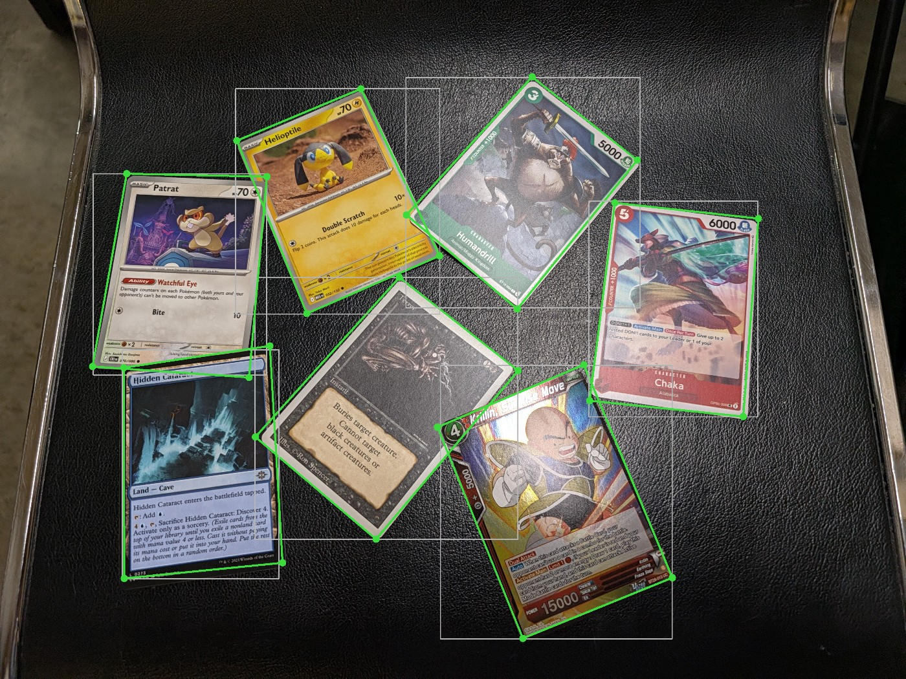
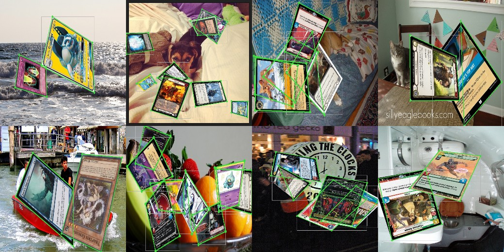

# YOLO Pose Card Detector

Training pipeline for the corner-keypoint detection model used by
[`card-scanner-siglip`](https://github.com/Tabletop-Village/card-scanner-siglip)
to find each card in a photo and perspective-warp it flat before
identification.

## Why pose instead of segmentation

The scanner originally used a YOLO segmentation model: detect a card's
mask, then approximate its 4 corners from the mask polygon
(`cv2.approxPolyDP`). That approach degrades badly on steeply rotated
cards -- the polygon approximation gets noisy exactly when you need it
most. A pose model regresses the 4 corners directly, which stays accurate
regardless of rotation angle. Confirmed on a real messy multi-card photo:
the segmentation model's crop came out visibly trapezoidal with
background bleed on a steeply-angled card, while the pose model's crop
was a clean, upright rectification of the same card (downstream
identification confidence went 70.3% -> 78.0% on that card as a result).

The trained model is hosted on the HF Hub:
[jackttv/card-scanner-yolo-pose](https://huggingface.co/jackttv/card-scanner-yolo-pose).

Live detections on a real, messy multi-card photo (green quad = the
model's 4 predicted corners, gray box = its bounding box) -- all 7 cards
found and tightly outlined despite heavy rotation and overlap:



## Pipeline

1. **Backgrounds**: COCO train2017/val2017 (118,287 / 5,000 images),
   unzipped into `backgrounds/train2017/` and `backgrounds/val2017/`
   (not tracked here -- ~19GB; any generic photo background set works).
2. **Card pool** (`build_pose_corpus.py`): symlinks `model_training/images/`
   to a capped sample (10k) of each TCG's catalog photos, so the model
   learns "a rectangular card, at any rotation/scale, against clutter" from
   a diverse set of border/holo styles rather than overfitting to any one
   game's visual conventions. As trained: Pokemon (English + Japan), One
   Piece, Magic: The Gathering, YuGiOh, Digimon, Lorcana, Flesh & Blood,
   Star Wars Unlimited -- 9 games, ~68k source images total. Catalog
   images themselves aren't included here (they come from
   [tcgcsv.com](https://tcgcsv.com), one game at a time); point
   `build_pose_corpus.py`'s `GAME_ROOTS` at wherever you've downloaded them.
3. **Synthetic composites** (`model_training/create_images.py` /
   `create_val_images.py`): overlay 1-8 cards per background image, at
   random rotation/perspective/scale, and label each card's 4 corners as
   pose keypoints. Corner coordinates are clamped to the image frame
   before writing labels -- ultralytics' loader discards an *entire*
   image's labels if any keypoint falls outside a ~1% tolerance of
   [0, 1], which a naive unclamped implementation hit on roughly half the
   dataset (rotated cards routinely extend past the frame). One output
   image per background image: 118,287 train / 5,000 val.

   A sample of labeled training examples (ground-truth keypoints drawn
   in green), across several of COCO's very different background scenes:

   

4. **Training** (`model_training/train.py`): `yolo26n-pose`, 100 epochs
   requested, `imgsz=640`. `optimizer=auto` picks ultralytics 8.4.137's new
   "Muon"/MuSGD optimizer, whose `muon_update()` crashes with a
   `.view()`-on-non-contiguous-tensor `RuntimeError` on this setup (a bug
   in that optimizer implementation, not anything dataset/model-specific)
   -- `train.py` pins `optimizer="AdamW"` to avoid it.

## Training results

Stopped early at epoch 67/100 -- validation metrics had clearly
plateaued (`model_training/training_results.csv` has the full per-epoch
log):

| Epoch | mAP50-95 (Box) | mAP50-95 (Pose) |
|---|---|---|
| 30 | 0.905 | 0.929 |
| 45 | 0.911 | 0.935 |
| 67 (final) | 0.914 | 0.939 |

Rapid gains through epoch ~30, then heavily diminishing returns -- only
+0.004-0.005 mAP50-95 over the last 20+ epochs. Running the remaining 33
epochs would have cost ~8 more hours for negligible improvement.

## Reproducing

```bash
# 1. Backgrounds -- any photo set works; COCO train2017/val2017 used here
# 2. Card pool
python3 build_pose_corpus.py
# 3. Synthetic composites (run from model_training/)
cd model_training
python3 create_images.py
python3 create_val_images.py
# 4. Train
python3 train.py
```

Needs `ultralytics>=8.4` (for the `yolo26n-pose` model/head), `opencv-python`,
`numpy`, `tqdm`.
